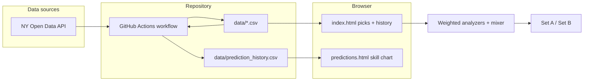

# CurryGohan Lottery Predictor

Static web app that loads Mega Millions and Powerball history, blends several weighted statistical signals into suggested tickets (**Set A** / **Set B**), and logs predictions against real draws with odds-aware scoring.

**Live site (GitHub Pages):** [https://currygohan.github.io/currygohan-predictor/](https://currygohan.github.io/currygohan-predictor/)

> **Disclaimer:** For entertainment only. Lottery draws are random. Nothing here predicts outcomes or constitutes gambling or financial advice.

---

## How the site works (high level)



1. **Draw data** — `data/mega_millions.csv` and `data/powerball.csv` hold normalized draws (`draw_date`, five whites, `bonus`, optional `multiplier`, `source`).
2. **Daily automation** — GitHub Actions runs `scripts/update_lottery_csvs.py` (fetch/merge from NY Open Data), then `scripts/log_predictions.mjs` (reconcile predictions, score results, append next draw’s lines).
3. **Home page** — Fetches the CSVs in the browser, shows the last 25 draws, and runs the analysis pipeline to display **Set A** and **Set B** for the **next scheduled draw date**.
4. **Prediction history** — Reads `data/prediction_history.csv`, shows each logged target draw, **skill %** (odds-adjusted) vs **raw %** (hits÷6), an aggregate **skill vs luck** summary, and a skill-over-time chart.

No build step: vanilla HTML, CSS, and ES modules served as static files.

---

## Analysis methods and weights

Each analyzer produces a score per white ball and per bonus ball. Scores are **scaled by weight** and **added** into one combined map (`js/analysis/combineScores.js`). **Set A** picks the top-scoring valid ticket from that map (`js/analysis/mixer.js`).

Weights are defined in `js/analysis/config.js` (`DEFAULT_ANALYSIS_WEIGHTS`). Set `enabled: false` or `weight: 0` to turn one off.

| Analyzer | Weight | Role |
|----------|--------|------|
| **Historical frequency** | 1.0 | How often each number appeared in history |
| **Transition (pairs)** | 0.55 | Patterns after the previous draw’s numbers |
| **Co-occurrence** | 0.45 | Numbers that tend to appear together on the same draw |
| **Spectral (graph modes)** | 0.35 | Eigenvector-style signal on a co-occurrence graph |
| **Compressibility (entropy proxy)** | 0.3 | Favors combinations with lower binary entropy structure |
| **Weekday of draw** | 0.22 | Mild bias by day-of-week of past draws on that weekday (explicitly “spurious”) |
| **Moon phase** | 0.2 | Mild bias by lunar phase bucket at draw time (spurious / fun) |
| **Sum & spread** | 0.28 | Targets typical total sum and spread of the five whites |

**Set B** uses the same combined scores unless **permutation null** is enabled (default **on**, 72 replicates): draw dates are shuffled many times, scores are recomputed, and Set B favors numbers that beat that null — a Monte Carlo “is this number unusually high under random dating?” check. Configure via `permutationNull` in `config.js` (not a weight; separate path in `js/analysis/suggest.js`).

---

## Prediction history and skill scoring

For each target draw the workflow logs Set A/B before the draw and fills **actual** numbers after the draw exists in the game CSV.

| Metric | Meaning |
|--------|---------|
| **Raw %** | `(white hits + bonus hit) / 6 × 100` — treats all six slots equally |
| **Skill %** | Percentile from a **z-score**: whites vs **hypergeometric** null (5 of N), bonus vs **1/pool size**; combined and mapped through a normal CDF (50% ≈ random) |
| **Skill vs luck** | One-sided test on mean skill z across all scored tickets; copy on the history page explains whether the sample still looks like chance |

Details: `js/stats/scoring.js`, `js/stats/skillChart.js`.

---

## Local development

```bash
cd currygohan-predictor
python3 -m http.server 8080
```

Open [http://localhost:8080/](http://localhost:8080/) and [http://localhost:8080/predictions.html](http://localhost:8080/predictions.html).  
(Opening `file://` URLs will block CSV `fetch` — use a local server.)

Refresh data and predictions manually:

```bash
python3 scripts/update_lottery_csvs.py
node scripts/log_predictions.mjs
```

---

## GitHub Pages deployment

1. Repo **Settings → Pages → Build and deployment**: deploy from branch **`main`**, folder **`/`** (root).
2. Site URL: `https://<user>.github.io/<repo-name>/` unless you use a [custom domain](https://docs.github.com/en/pages/configuring-a-custom-domain-for-your-github-pages-site).

---

## Traffic / analytics

**GitHub does not provide visitor analytics for Pages.** Repo **Insights → Traffic** only shows git clones/views of the repository, not how many people opened the website.

**Recommended: Google Analytics 4 (optional, built in)**

1. Create a GA4 property: [Google Analytics](https://analytics.google.com/) → Admin → **Data streams** → Web.
2. Copy the **Measurement ID** (`G-XXXXXXXXXX`).
3. Set it in `js/site-config.js`:

   ```js
   export const GA_MEASUREMENT_ID = "G-XXXXXXXXXX";
   ```

4. Push to `main`. Both `index.html` and `predictions.html` load `js/analytics.js`, which injects gtag only when the ID is set.

Leave `GA_MEASUREMENT_ID` as `""` to disable tracking entirely.

**Alternatives:** [Plausible](https://plausible.io/), [Fathom](https://usefathom.com/), or [Cloudflare Web Analytics](https://www.cloudflare.com/web-analytics/) (if the site is behind Cloudflare) — would need a small script change similar to `analytics.js`.

If you enable analytics, consider adding a short privacy note to the site footer (GA may collect IPs unless you configure consent mode in GA).

---

## Automated updates (GitHub Actions)

Workflow: `.github/workflows/update-draws.yml`

- **Schedule:** twice daily UTC (`06:15`, `16:15`) to catch US evening draw windows
- **Steps:** Python updater → Node prediction logger → commit `data/mega_millions.csv`, `data/powerball.csv`, `data/prediction_history.csv` if changed

**NY Open Data 403 in CI:** add repository secret **`SOCRATA_APP_TOKEN`** (Socrata app token from [data.ny.gov](https://data.ny.gov/)). The updater exits successfully without changing files if the fetch fails, so the site keeps working but may stay stale until the next good run.

**Optional:** set Actions variable `MERGE_OFFICIAL_CSV=true` to also merge root `megamillions.csv` / `powerball.csv` when present.

---

## Project layout

| Path | Purpose |
|------|---------|
| `index.html`, `predictions.html` | Pages |
| `js/app.js` | Home page: load CSVs, table, picks |
| `js/predictionsPage.js` | History cards, chart, luck summary |
| `js/analysis/*` | Analyzers, merge, suggest, schedule |
| `js/stats/*` | Skill scoring and chart |
| `js/site-config.js` | GA measurement ID (and other site flags) |
| `data/*.csv` | Draw history + prediction log (updated by CI) |
| `scripts/update_lottery_csvs.py` | Fetch/merge/prune draws |
| `scripts/log_predictions.mjs` | Append/reconcile/score predictions |

---

## Draw schedule (used for “next draw” dates)

- **Mega Millions:** Tuesday & Friday  
- **Powerball:** Monday, Wednesday & Saturday  

Logic: `js/analysis/schedule.js`, `js/analysis/weekday.js`.

---

## License and contributions

Personal project; use at your own risk. Pull requests welcome for data quality, analyzers, or docs.
